## Langkah 1

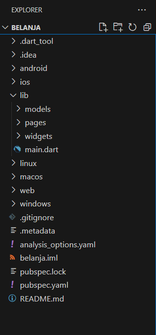

## Langkah 2

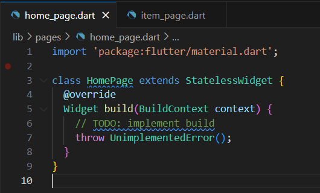

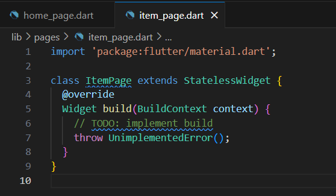

## Langkah 3

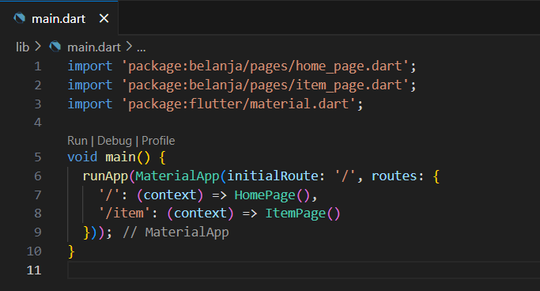

## Langkah 4

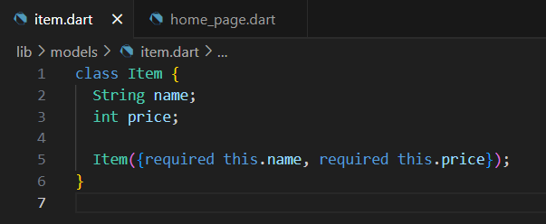

## Langkah 5

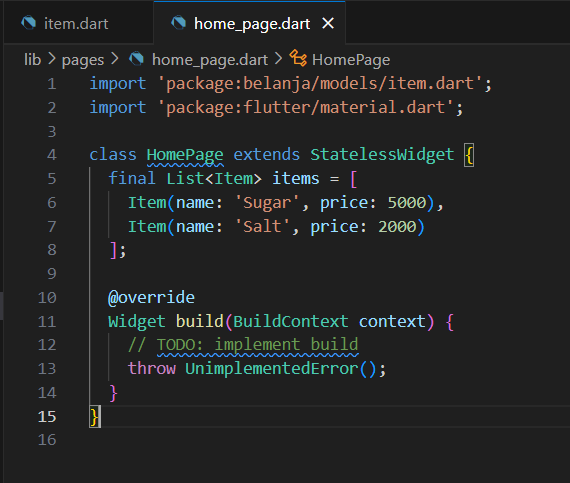

## Langkah 6

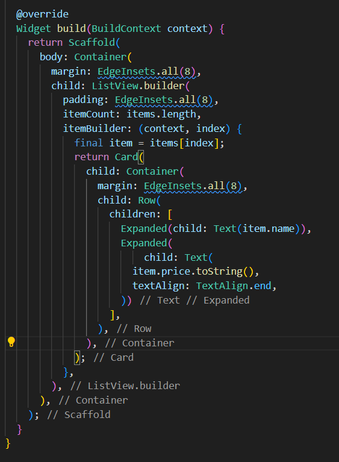

## Langkah 7

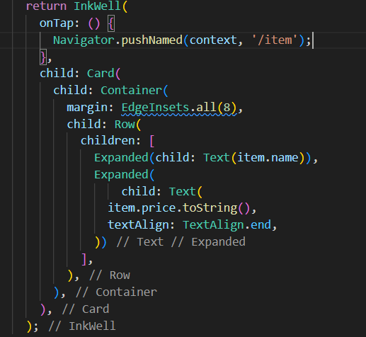

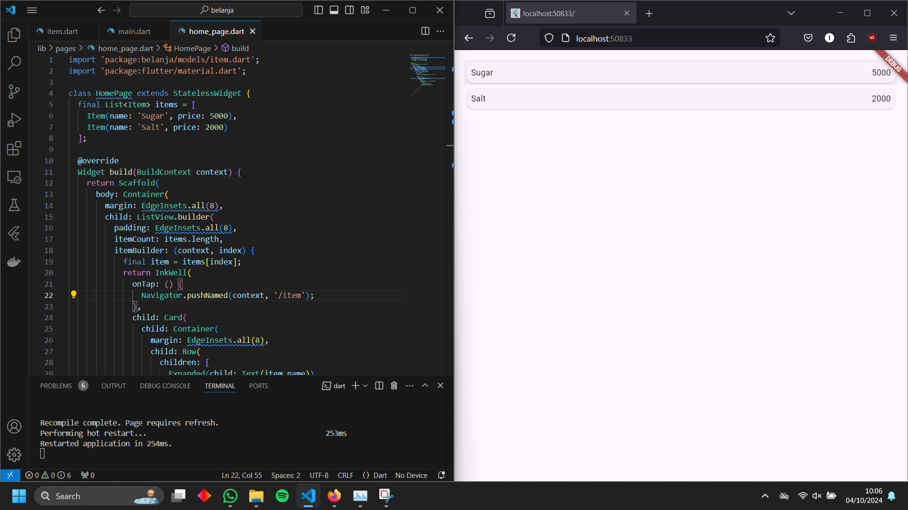

## Tugas Praktikum 2 - 1

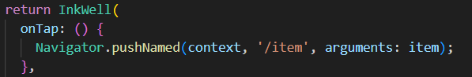

## Tugas Praktikum 2 - 2

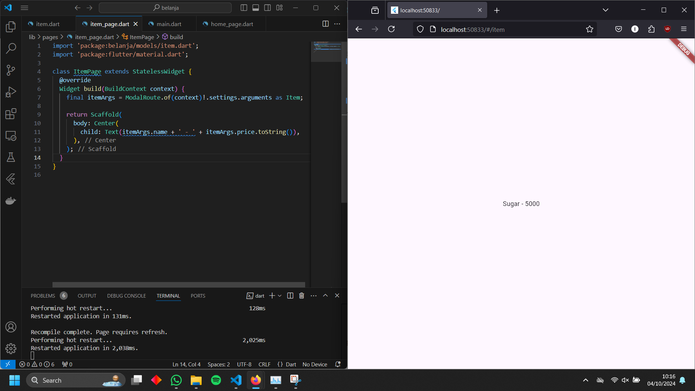

## Tugas Praktikum 2 - 3

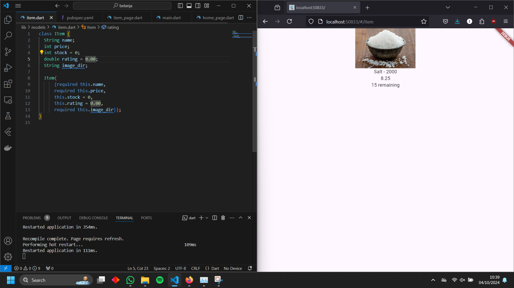

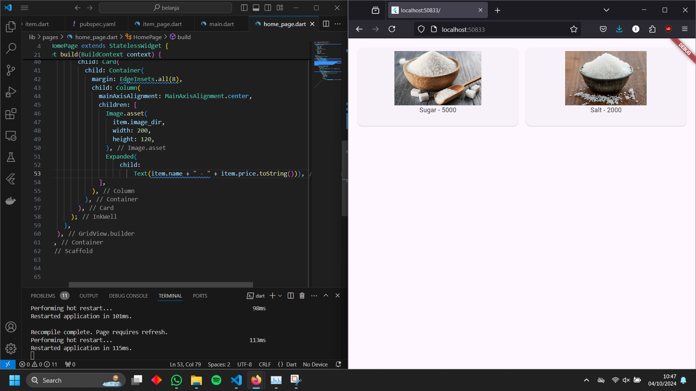

## Tugas Praktikum 2 - 4

<video src="Images/11.mp4" width="400" controls></video>

## Tugas Praktikum 2 - 5

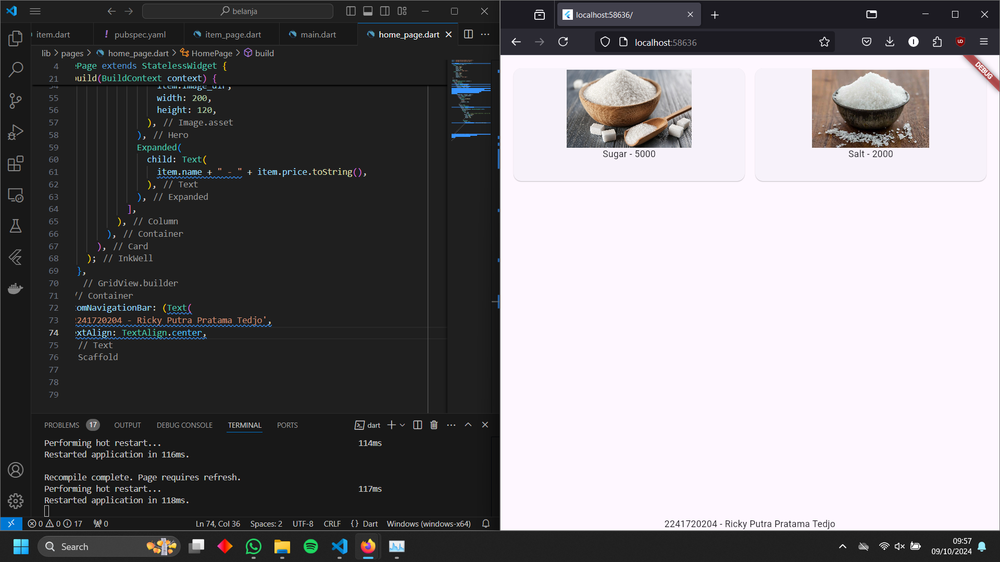

## Tugas Praktikum 2 - 6

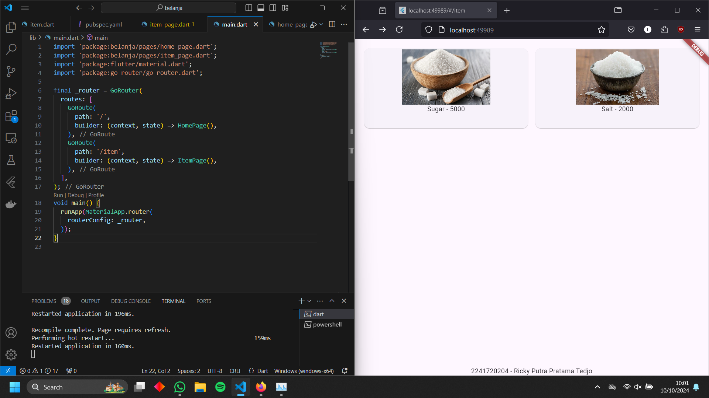

